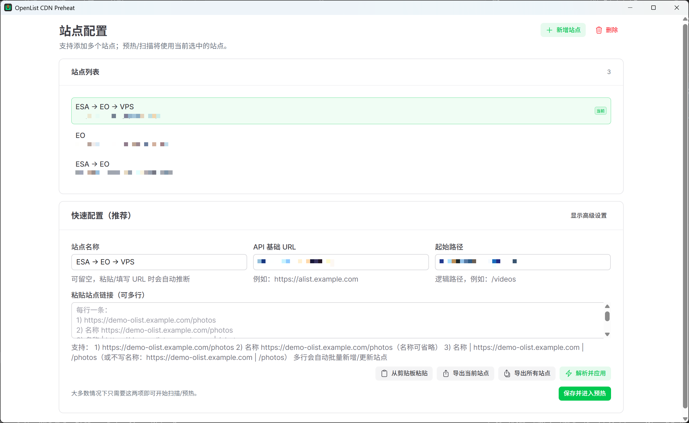
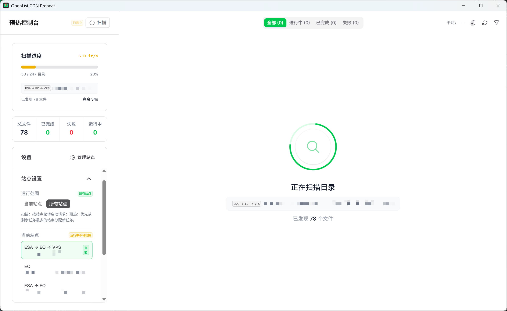
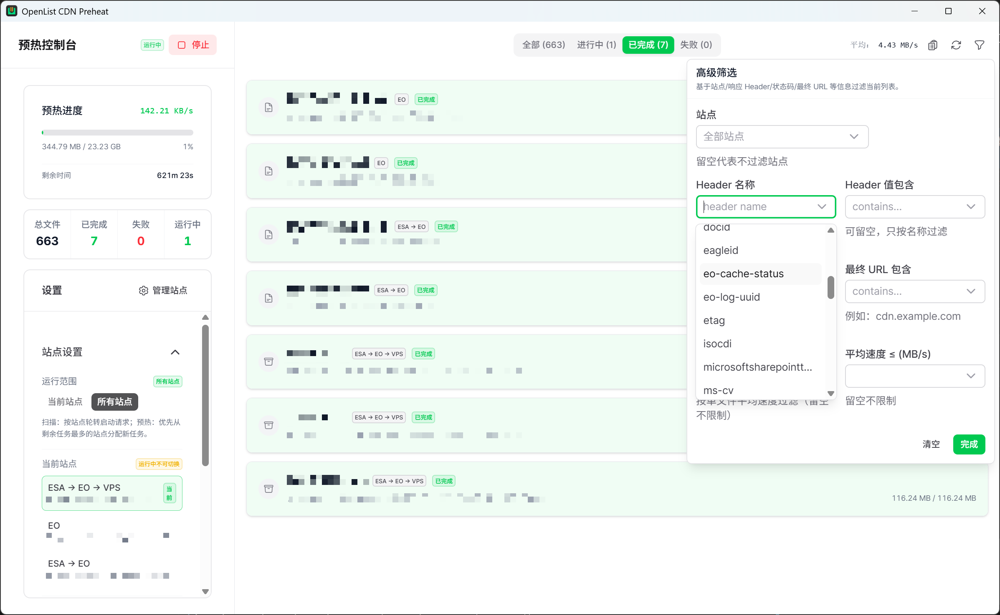

# OpenList CDN Preheat

专为 OpenList/AList 站点设计的 CDN 缓存预热工具。通过递归扫描目录并模拟下载请求，将指定路径（如 `/d/...`）的资源主动推入 CDN 节点缓存，从而提升用户访问体验。

> **注意**：本工具仅用于触发 CDN 缓存（读取响应流至 EOF），不会将文件保存至本地磁盘。

## 功能特性

- **多站点管理**：支持配置多个 OpenList/AList 站点，支持一键切换与批量管理。
- **递归扫描**：基于 OpenList API 递归枚举目录文件，支持分页处理与断点续传。
- **智能预热**：
  - **完整读取**：对目标文件发起 HTTP GET 请求并读取响应流直至 EOF，确保 CDN 节点完成回源与缓存。
  - **WAF 适配**：内置 WAF 探测与 Cookie 自动刷新机制（支持弹出 Solver 窗口），适配高防护站点。（建议在 WAF 侧为本工具 User-Agent 设置白名单放行。）
- **调度与流控**：
  - **并发控制**：支持自定义最大并发数与全局带宽限制（MB/s）。
  - **自适应调度**：多站点轮询扫描，预热任务基于负载均衡策略自动分配。
- **可观测性**：
  - **实时监控**：提供实时吞吐量、进度百分比及剩余时间预估（ETA）。
  - **高级筛选**：支持按站点、HTTP 状态码、最终 URL、响应头（Header）及平均速度进行多维度筛选与分析。
- **排障辅助**：详细记录每个文件的请求耗时、状态码及响应头，便于定位回源失败或缓存未命中问题。

## 最佳实践：CDN 缓存配置

本工具的核心机制是针对 OpenList 的稳定下载路径（通常以 `/d` 开头）进行预热。为了达到最佳效果，建议在 CDN 侧（如 EdgeOne、ESA、Cloudflare 等）进行如下配置。

### 核心策略

对 `URLPath` 以 `/d` 开头的请求配置**强制缓存**规则。

### 场景 A：重定向模式（通用）

适用于标准 AList/OpenList 站点，源站通常返回 302 重定向至存储源。

**CDN 配置建议：**
1. **规则匹配**：`URLPath` 前缀为 `/d`。
2. **回源策略**：启用 **回源跟随重定向 (Follow Redirects)**。CDN 节点将跟随源站的 302 跳转，直接从存储源拉取数据并缓存。
3. **缓存规则**：配置强制缓存（如 365 天）。

### 场景 B：本机代理模式（OpenList Server）

适用于使用 OpenList Server 且开启了“本机代理”功能的站点。此时源站直接返回文件流，而非 302 跳转。

**CDN 配置建议（EdgeOne / ESA / Cloudflare 等）：**
1. **OpenList Server 侧**：确保已启用“本机代理”功能。
2. **CDN 侧**：
   - **规则匹配**：`URLPath` 前缀为 `/d`。
   - **缓存规则**：配置强制缓存。
   - **回源策略**：无需开启跟随重定向（因为源站直接响应数据）。

> **提示**：
> - 预热过程会产生回源流量，请根据源站带宽与 CDN 计费策略合理规划。
> - 部分免费 CDN 套餐可能仅提供单层缓存，预热后仍可能出现部分回源请求，属于正常现象。

### 防火墙与 WAF 配置

为避免因高频预热请求触发防火墙拦截，建议在 CDN 或 WAF 侧配置 User-Agent 白名单。

- **默认 User-Agent**：`olist-cdn-preheat/0.1 (Mozilla/5.0 compatible)`
- **配置建议**：放行 User-Agent 包含 `olist-cdn-preheat` 的请求。

## 快速开始

### 1. 安装

建议直接下载最新 Release 版本。

### 2. 配置站点

在“站点管理”页面添加目标站点：

- **API 地址**：OpenList 站点的 API Base URL。
- **Token**：API 访问令牌（公开目录可留空）。
- **起始路径**：需要预热的根目录路径。
- **下载域名**：通常填写 CDN 加速域名（用于构造预热请求）。
- **代理设置**：如需强制走特定网络链路可配置 HTTP 代理。



### 3. 执行预热

进入“预热控制台”：

1. 点击 **扫描** 获取文件列表。
2. 调整 **并发数** 与 **限速阈值**。
3. 点击 **开始** 启动预热任务。



### 4. 数据分析与排障

使用“高级筛选”功能分析预热结果：

- 检查非 200 状态码的文件。
- 验证最终 URL 是否符合预期（检查是否命中 CDN）。
- 通过响应头（如 `cf-cache-status`, `x-cache`）确认缓存状态。



## 常见问题

**Q: 为什么建议匹配 `/d` 路径？**
A: `/d/...` 是 OpenList 的固定下载路径，不包含动态签名或临时参数，最适合作为 CDN 的缓存 Key。

**Q: 预热速度过快会导致源站异常吗？**
A: 可能。建议初次使用时设置较低的并发数与带宽限制，观察源站负载后再逐步调优。

**Q: 遇到大量 302 跳转但未缓存？**
A: 请检查场景 A 的配置，确认 CDN 已开启“回源跟随重定向”。如果 CDN 不支持该功能，则无法缓存 302 跳转后的内容（除非使用场景 B 的本机代理模式）。

## 开发构建

本项目基于 Nuxt 4 + Tauri 2 技术栈。

```bash
# 安装依赖
bun install

# 开发模式
bun run tauri:dev

# 生产构建
bun run tauri:build
```

## License

[MPL-2.0](./LICENSE)
